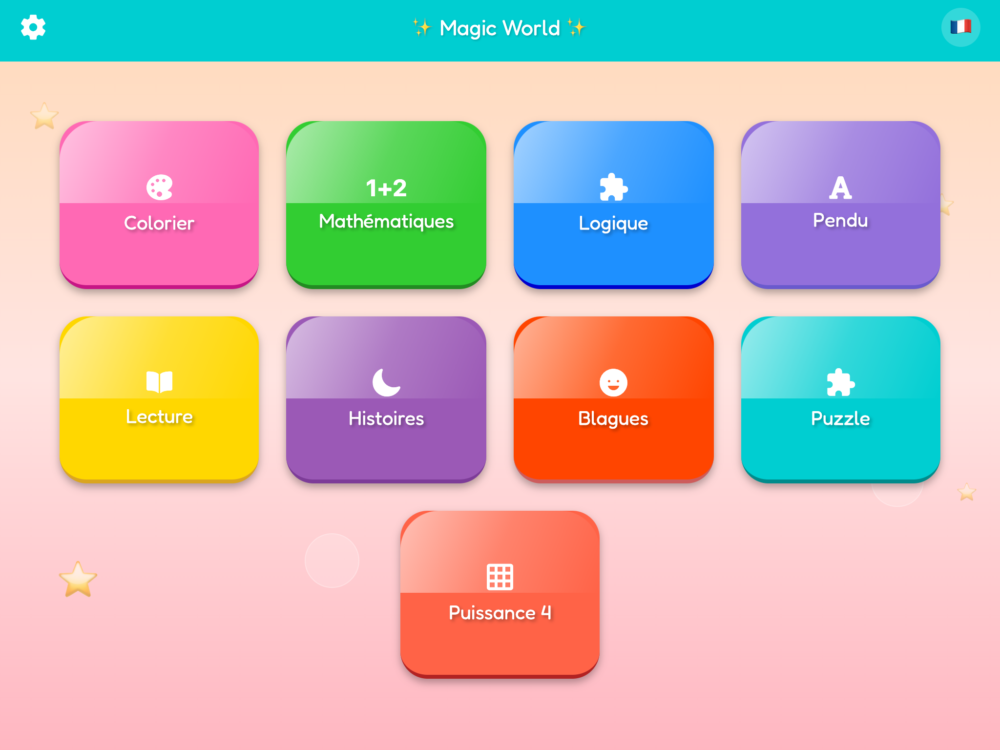
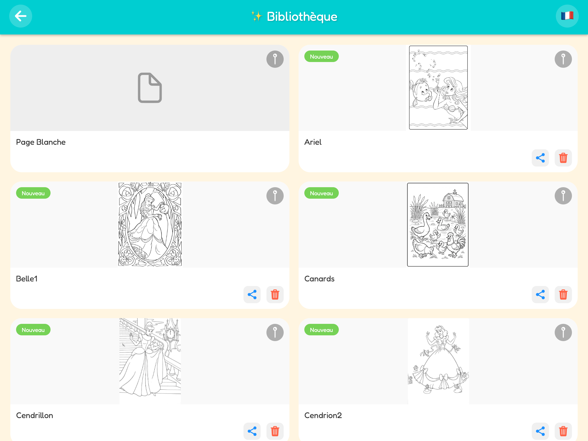
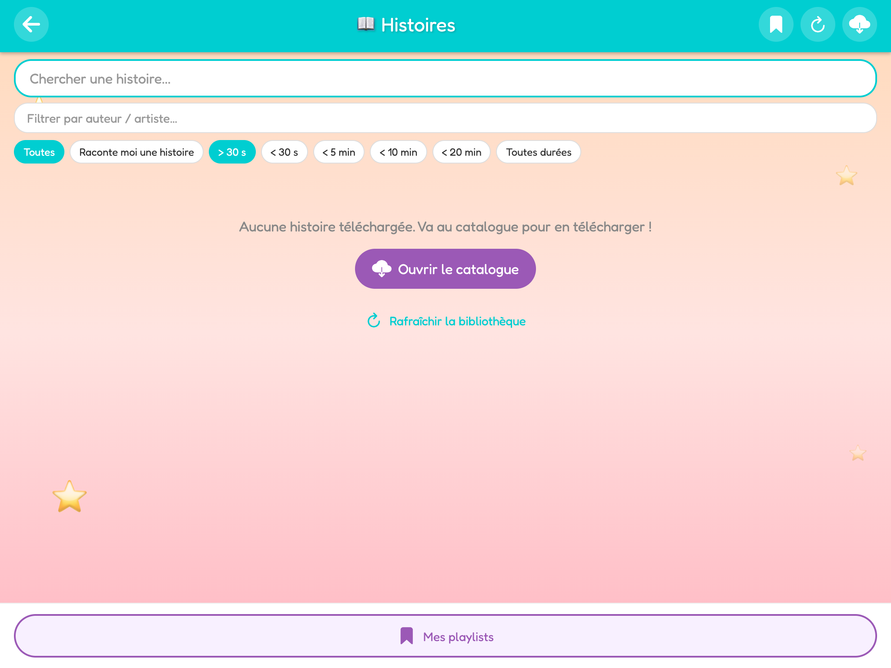
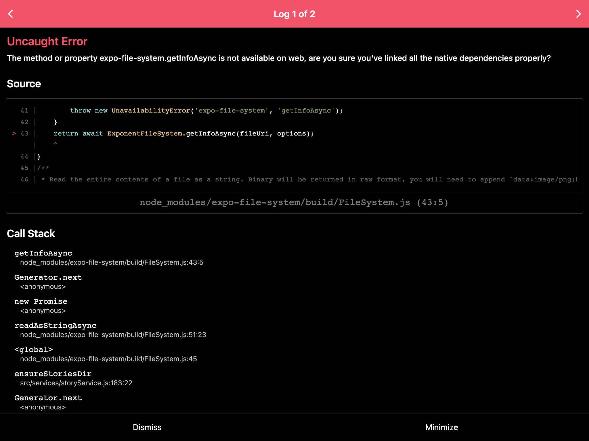
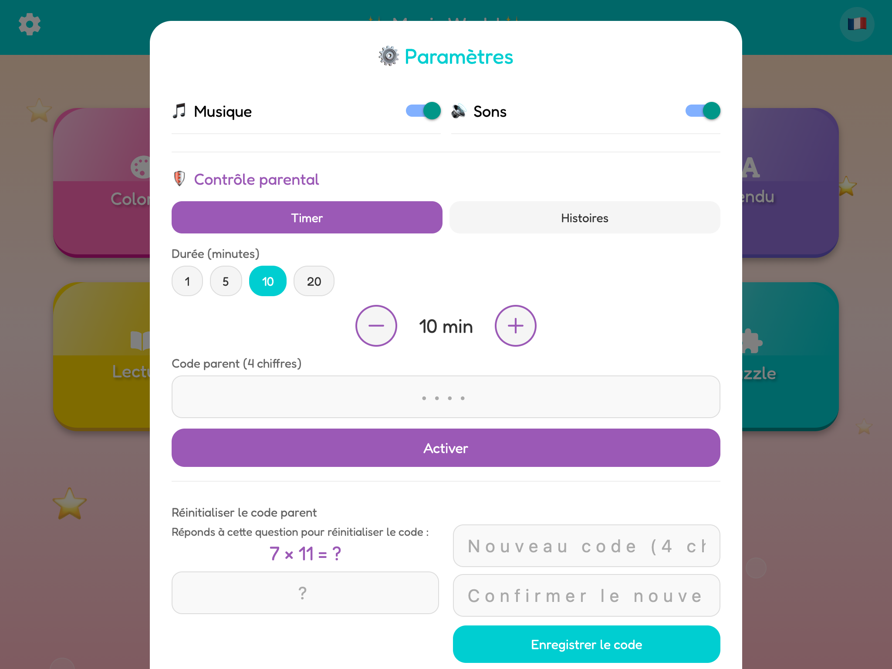
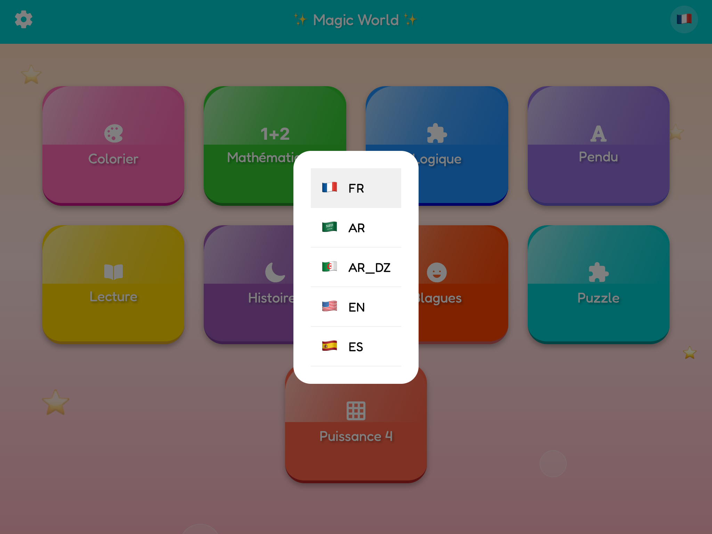

# Mon Monde Magique / Magic World

An educational and playful app for children aged **5–10**, available in **French**, **English**, **Arabic**, **Algerian Darija**, and **Spanish**. Optimized for **Android and iOS tablets**.



---

## Features at a glance

| Module | Description | Screenshot |
|--------|-------------|------------|
| **Magic Coloring** | Photo-to-sketch, 12-color palette, glitter, eraser, bucket fill, zoom, gallery | [Library](./assets/docs/screenshots/02-coloring-library.png) · [Canvas](./assets/docs/screenshots/13-coloring-canvas.png) |
| **Math** | Progressive arithmetic with tutorials | [Math](./assets/docs/screenshots/03-math.png) |
| **Logic & Shapes** | Drag-and-drop shape recognition | [Logic](./assets/docs/screenshots/04-logic.png) |
| **Hangman** | French word guessing game | [Hangman](./assets/docs/screenshots/05-hangman.png) |
| **Reading** | Fun reading activities | [Reading](./assets/docs/screenshots/06-reading.png) |
| **Stories & Music (Lunii)** | 200+ downloadable audio packs, library, player, playlists | [Library](./assets/docs/screenshots/07-stories-library.png) · [Catalogue](./assets/docs/screenshots/08-story-packages.png) |
| **Jokes** | Kid-friendly jokes | [Jokes](./assets/docs/screenshots/09-jokes.png) |
| **Puzzles** | Multiple difficulty levels | [Puzzles](./assets/docs/screenshots/10-puzzle-library.png) |
| **Connect 4** | Two-player board game | [Connect 4](./assets/docs/screenshots/11-connect4.png) |
| **Spot the Difference** | Find 7 differences between two images | [Differences](./assets/docs/screenshots/12-differences.png) |
| **Parental Controls** | Timer, story limit, PIN lock | [Settings](./assets/docs/screenshots/14-parental-settings.png) |
| **Languages** | FR · EN · AR · AR-DZ · ES | [Language picker](./assets/docs/screenshots/15-language-picker.png) |

---

## Magic Coloring

Turn photos into line drawings or pick from **40+ built-in coloring pages** (princesses, animals, farm, cats, and more).

- 12-color palette + custom color picker
- Pen, eraser, bucket fill (magic wand), shapes (circle, square, star)
- Glitter effects (6 animated sprites)
- Pinch-to-zoom and pan while drawing
- Save drawings to gallery, share, delete



---

## Stories & Music (Lunii module)

Full **audio library** with 200+ downloadable Lunii-compatible packs:

- **Catalogue** — browse packs, thumbnails, sizes, filters, MEGA/HTTP download
- **Streaming extraction** — native unzip on dev/prod builds (~10× faster)
- **Local library** — stories and songs from `story.json` + MP3 assets
- **Filters** — name, source, type (story/song), artist, album, genre, pack, duration
- **Queue** — multi-select, reorder, sequential playback
- **Player** — clickable timeline, cover art, prev/next, pause, resume
- **Progress** — per-story position saved inside playlists
- **Named playlists** — save, list, delete, resume
- **Parental control** — story limit, timer, PIN lock
- **Thumbnails** — extracted from MP3/pack, auto-repair of expired URLs





---

## Parental Controls & Settings

Parents can set a **4-digit PIN** and choose:

- **Timer mode** — limit play time (1–180 min)
- **Story mode** — limit number of stories listened to

PIN reset requires a simple math challenge. Audio (music + sound effects) can be toggled independently.



---

## Audio & Interface

- Looping background music, effect sounds (click, success, error, win)
- Animated pastel background, **Fredoka-SemiBold** font, glossy buttons
- 5 languages via `constants/Strings.js`



---

## Architecture

```
MonMondeMagique/
├── app/                      # Expo Router routes
│   ├── stories.js            # Local story library
│   ├── story_packages.js     # Catalogue / downloads
│   ├── story_player.js       # Audio player
│   └── …                     # Games (math, hangman, coloring, …)
├── src/
│   ├── screens/              # Main screens
│   ├── components/
│   │   ├── shared/           # Header, StoryCoverImage, banners…
│   │   └── stories/          # Queue, playlist modals, StoryGridCard
│   ├── services/
│   │   ├── storyService.js   # Library, downloads, progress
│   │   ├── megaFile.js       # MEGA pipeline (download → decrypt → unzip)
│   │   ├── zipExtract.js     # Streaming unzip + write queue
│   │   ├── nativeZip.js      # Native unzip (react-native-zip-archive)
│   │   ├── mp3Metadata.js    # Duration, ID3 tags, MP3 covers
│   │   └── luniiStoryParser.js
│   └── utils/
├── contexts/
│   ├── SoundContext.js
│   ├── LanguageContext.js
│   ├── ParentalControlContext.js
│   └── StoryDownloadContext.js
├── assets/
│   ├── docs/screenshots/     # README documentation images
│   ├── stories/catalog.json  # ~200 Lunii packs
│   ├── coloriages/
│   ├── music/
│   └── sounds/
└── constants/Strings.js
```

### Story flow

```
catalog.json → StoryPackagesScreen → downloadPackage()
    → MEGA (pack.enc) or HTTP (pack.zip)
    → native unzip (fast) or JS streaming fallback
    → story.json + assets/*.mp3
    → AsyncStorage + library-index.json
    → StoriesScreen → StoryPlayerScreen
```

---

## Installation

### Requirements

- Node.js 18+
- npm or yarn
- Expo CLI (`npx expo`)

### Quick start

```bash
cd MonMondeMagique
npm install
npx expo start
```

- `a` → Android · `i` → iOS · QR code → Expo Go · `w` → Web

### Production build (EAS)

```bash
eas build --platform android --profile production
eas build --platform ios --profile production
```

Project: `clevercontent-llc/magic-world` · config in `eas.json`.

### Useful scripts

```bash
npm test                    # Jest
npm run guard               # Tests + validation
npm run extract-stories     # Regenerate catalog.json from Lunii source
node scripts/capture-screenshots.mjs   # Regenerate README screenshots (web)
```

---

## Downloads & performance

Downloads run in the **background** with:

- Native resumable download (`expo-file-system`)
- **Native unzip** via `react-native-zip-archive` on dev/prod builds
- MEGA: decrypt → zip → native unzip for packs ≤ 90 MB
- JS fallback: 16 MB chunks, 16 parallel writes, directory cache
- UI yield between chunks so the tablet stays usable during extraction

See **[PERFORMANCE.md](./PERFORMANCE.md)** for full details.

---

## Story storage

| Key / file | Content |
|------------|---------|
| `{documentDirectory}stories/` | Extracted packs by `packId` |
| `library-index.json` | Fast library index |
| `STORIES_META` (AsyncStorage) | Per-story metadata |
| `STORIES_PACKAGES_META` | Installed packs |
| `STORIES_PROGRESS` | Playback progress (per story) |
| `STORIES_SAVED_PLAYLISTS` | Named playlists + progress |

---

## Tech stack

| Area | Stack |
|------|--------|
| Framework | Expo SDK 50, React Native 0.73 |
| Navigation | Expo Router 3 |
| Audio | expo-av, timeline slider |
| Files | expo-file-system, fflate, megajs, react-native-zip-archive |
| Drawing | @shopify/react-native-skia |
| Storage | AsyncStorage |
| Tests | Jest, React Native Testing Library |

---

## Customization

### Coloring pages

Add PNG/WebP files to `assets/coloriages/` (black lines on white background).

### Sounds

Place in `assets/sounds/`: `click.mp3`, `success.mp3`, `wrong.mp3`, `win.mp3`  
(see `assets/sounds/README.md`).

### Story catalogue

`assets/stories/catalog.json` — generated via `scripts/extract-conty-catalog.js`.

---

## Further documentation

- [IMPROVEMENTS.md](./IMPROVEMENTS.md) — advanced enhancements (sounds, shaders, etc.)
- [CHANGELOG.md](./CHANGELOG.md) — version history
- [PERFORMANCE.md](./PERFORMANCE.md) — performance optimizations (July 2026)

---

## Licence

© Mon Monde Magique — educational app for children.

---
---

# 🇫🇷 Mon Monde Magique — en français

Application éducative et ludique pour enfants de **5 à 10 ans**, en **français**, **anglais**, **arabe**, **darija algérienne** et **espagnol**. Optimisée pour **tablettes** Android et iOS.


## Fonctionnalités principales

| Module | Description |
|--------|-------------|
| **Coloriage magique** | Photos → dessin au trait, 12 couleurs, paillettes, gomme, seau, zoom |
| **Calculs** | Mathématiques progressives avec tutoriels |
| **Logique & formes** | Glisser-déposer, reconnaissance des formes |
| **7 différences** | Trouver les différences entre deux images |
| **Pendu** | Mots en français |
| **Connect 4** | Puissance 4 |
| **Puzzles** | Plusieurs niveaux de difficulté |
| **Blagues & lecture** | Contenus ludiques |
| **Histoires Lunii** | 200+ packs audio téléchargeables, bibliothèque, lecteur, playlists |

## Histoires et musiques

- **Catalogue** avec vignettes, filtres et téléchargement MEGA/HTTP
- **Extraction native** (~10× plus rapide sur builds dev/prod)
- **Bibliothèque locale** avec filtres avancés et file d'attente
- **Lecteur** avec timeline, pochette, progression par histoire
- **Playlists nommées** et **contrôle parental** (minuterie, limite d'histoires, PIN)


## Contrôle parental

Les parents définissent un **code PIN à 4 chiffres** :

- Mode **minuterie** (1–180 min)
- Mode **histoires** (nombre limité)


## Démarrage rapide

```bash
cd MonMondeMagique
npm install
npx expo start
```

---
---

# 🇩🇿 Mon Monde Magique — b darija dzayriya

App ta3lmiya w maḍḥka l lʿiyal lʿumr mtaʿhom mn **5 l 10 snin**. Kayna b **fransé**, **nngliziya**, **3rabiya**, **darija dzayriya** w **sbanyuliya**. Mṣayyaʿa l **tablét** Android w iOS.


## Wach kayen f l'app?

| Lmodule | Wach kaydir |
|---------|-------------|
| **Coloriage** | Tsawer w tlawwen, 12 lwan, brikat, gomme, seau, zoom |
| **Mathématiques** | Ḥsab mʿa chwiya b chwiya |
| **Logique** | Formes w drag-and-drop |
| **7 différences** | Lqa l farq bin tswirat |
| **Pendu** | Lʿab b lktaba f fransé |
| **Puissance 4** | Connect 4 mʿa ṣaḥbek |
| **Puzzle** | Bzaf d les niveaux |
| **Blagues w lecture** | Contenu maḍḥek |
| **Histoires Lunii** | 200+ pack audio, bibliothèque, lecteur, playlists |

## Histoires w mūsīqā

- **Catalogue** b vignettes w filtres, téléchargement MEGA/HTTP
- **Extraction sari3a** (~10× f builds dev/prod)
- **Bibliothèque locale** b filtres w file d'attente
- **Lecteur** b timeline w pochette, koul histoire tḥfed l blasa li wqef fiha
- **Playlists** w **contrôle parental** (minuterie, limit histoires, PIN)


## Contrôle parental

L walidin ydiru **PIN 4 arqam** :

- **Minuterie** (1–180 dqiqa)
- **Limit histoires** (adad maḥdud)


## Bda l'app

```bash
cd MonMondeMagique
npm install
npx expo start
```

Scani l QR code b **Expo Go** w khalih ylʿeb b lṭfl! 🎨📖✨

---

© Mon Monde Magique — app ta3lmiya l lʿiyal.
